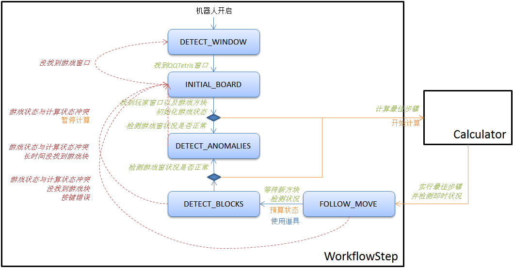

# xytetrisbot

## Description

A simple Tetris-Bot using pre-defined strategies to play against other human players. (written in Java and uses JNA and JIntellitype.dll)

## System Design

## In Action

